# 2026 OOPL Final Report

## 組別資訊

- 組別：T37
- 組員：電資二 113820016 林稚蓁
- 復刻遊戲：Super Mario Bros 1 (FC / NES, 1985)

## 專案簡介

### 遊戲簡介

- 本專案使用助教提供的 **PTSD**（SDL2-based）遊戲框架，以 **C++17** 搭配 **CMake** 建置系統，復刻經典的 2D 橫向捲軸動作遊戲《超級瑪利歐兄弟》（Super Mario Bros 1）。
- 遊戲完整還原了玩家的核心操控體驗：左右移動、跳躍、踩踏敵人之外，也實作了吃蘑菇變大、吃火花發射火球，以及吃無敵星星進入閃爍無敵狀態等經典變身機制。
- 關卡方面實作了三個代表性關卡：起點 **World 1-1（地面）**、**World 1-2（地下）** 與 **World 1-3（空中平台）**；另外還有由綠色水管進入的隱藏地下金幣房（pipe1、pipe2），進出皆有水管滑入／升起的動畫與音效。玩家需運用各種道具與動作技巧穿越障礙與敵人，最後滑下旗桿、走進城堡完成關卡。

### 組別分工

- 本組為 **個人組（T37）**，這款瑪利歐遊戲從無到有的所有開發與設計工作皆由我一人獨自完成。
- 具體工作包含：遊戲企劃與規則設計、整體程式架構與設計模式套用、核心物理與碰撞邏輯、文字檔關卡地圖設計、敵人 AI、道具系統、UI 與音效／音樂整合，以及測試除錯與期末報告撰寫。

## 遊戲介紹

### 遊戲規則

#### 操作方式

| 按鍵 | 功能 |
|:---:|---|
| `←` `→` | 左右移動 |
| `Space` | 跳躍（按住越久跳越高） |
| `Z` | 衝刺（加速奔跑） |
| `↓` | 蹲下；站在水管口時按下進入水管 |
| `X` | 發射火球（火花馬力歐限定） |
| `Esc` | 離開遊戲 |

---

#### 馬力歐型態 (Mario State)

| 圖示 | 型態 | 說明 |
|:---:|:---:|---|
| 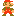 | **小馬力歐 (Small)** | 最基本的狀態，被敵人碰到就直接失去一條命。 |
|  | **大馬力歐 (Big)** | 吃蘑菇變大，可以撞碎磚塊；被敵人碰到只會縮回小馬力歐，多一次容錯。 |
|  | **火花馬力歐 (Fire)** | 吃火花變身，可以按 `X` 發射火球打倒敵人。 |
|  | **無敵星星 (Star)** | 吃星星後身體閃爍無敵，可以直接輾過碰到的敵人。 |

---

#### 敵人介紹

| 圖示 | 名稱 | 特性 |
|:---:|:---:|---|
|  | **哥姆巴 (Goomba)** | 最普通的敵人，左右巡邏、撞牆回頭，可被踩扁或火球擊倒。 |
|  | **庫巴 (Koopa)** | 踩一下會縮進龜殼；踢出的龜殼能連續撞飛其他敵人，也能撞破磚塊。 |
|  | **飛行庫巴 (Paratroopa)** | 長翅膀的庫巴，原地上下飛行；踩一下翅膀會掉落，變回一般庫巴。 |
|  | **食人花 (Piranha Plant)** | 躲在水管裡定時伸出；玩家站太近時不會伸出（安全距離偵測，防偷襲）。 |

---

#### 道具介紹

| 圖示 | 名稱 | 效果 |
|:---:|:---:|---|
|  | **蘑菇 (Mushroom)** | 讓馬力歐變大，可以敲碎磚塊。 |
|  | **火花 (Fire Flower)** | 讓馬力歐變成火花型態，可以發射火球。 |
|  | **無敵星星 (Star)** | 短時間內無敵，碰到敵人直接撞飛。 |
|  | **金幣 (Coin)** | 吃金幣加分，集滿 100 個多加一條命。 |
|  | **超級火花 (Super Flower)** | 特殊強化道具。 |

---

#### 關卡流程

```
World 1-1 (地面關卡)
    ↓ 滑下旗桿
World 1-2 (地下關卡 — 移動平台 / 食人花)
    ↓ 經由水管抵達地面終點段，滑下旗桿
World 1-3 (空中平台關卡)
    ↓ 滑下旗桿
★ 通關！

（各關卡的綠色水管可蹲入隱藏地下金幣房 pipe1 / pipe2，再由水管返回）
```

---

#### Debug / 作弊模式

開發測試用的輔助按鍵：

| 按鍵 | 功能 |
|:---:|---|
| `0`–`9` | 直接切換到指定關卡 |
| `G` | 切換無敵（God Mode，免疫敵人與落谷） |
| `V` | 循環切換變身（小 → 大 → 火花） |
| `I` | 取得無敵星星 |
| `T` | 增加時間 |
| `N` | 增加一命 |

---

#### 遊戲機制補充

| 機制 | 說明 |
|---|---|
| **生命系統** | 一開始有 3 條命。小馬力歐被敵人碰到、掉進深谷都會扣命，命扣完即 Game Over。 |
| **時間限制** | 每關 400 秒，以 2.5 倍速倒數；過關時依剩餘秒數結算加分。 |
| **踩踏連擊** | 腳不落地連續踩敵人，分數會逐步翻倍（100 → … → 8000，再之後直接送命）。 |
| **金幣獎命** | 集滿 100 個金幣自動加 1 條命。 |
| **龜殼連段** | 踢出的龜殼連續消滅敵人時分數遞增，也能撞破磚塊。 |

### 遊戲畫面

#### 遊玩畫面

| 畫面 | 截圖 |
|:---:|:---:|
| 小馬力歐（World 1-1 起點） | 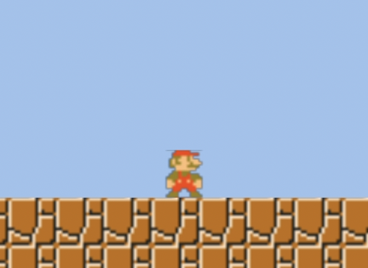 |
| 大馬力歐（吃蘑菇變身，可撞破磚塊） | 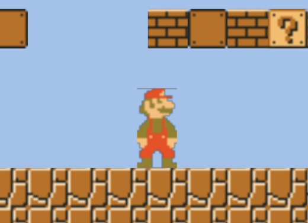 |
| 火花馬力歐（可發射火球） | 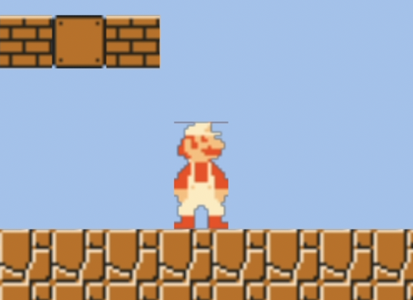 |
| 踩踏敵人（Stomp） | 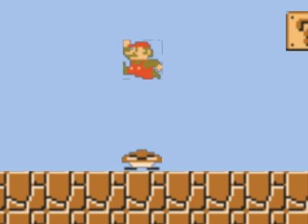 |
| World 1-2（地下關卡） | 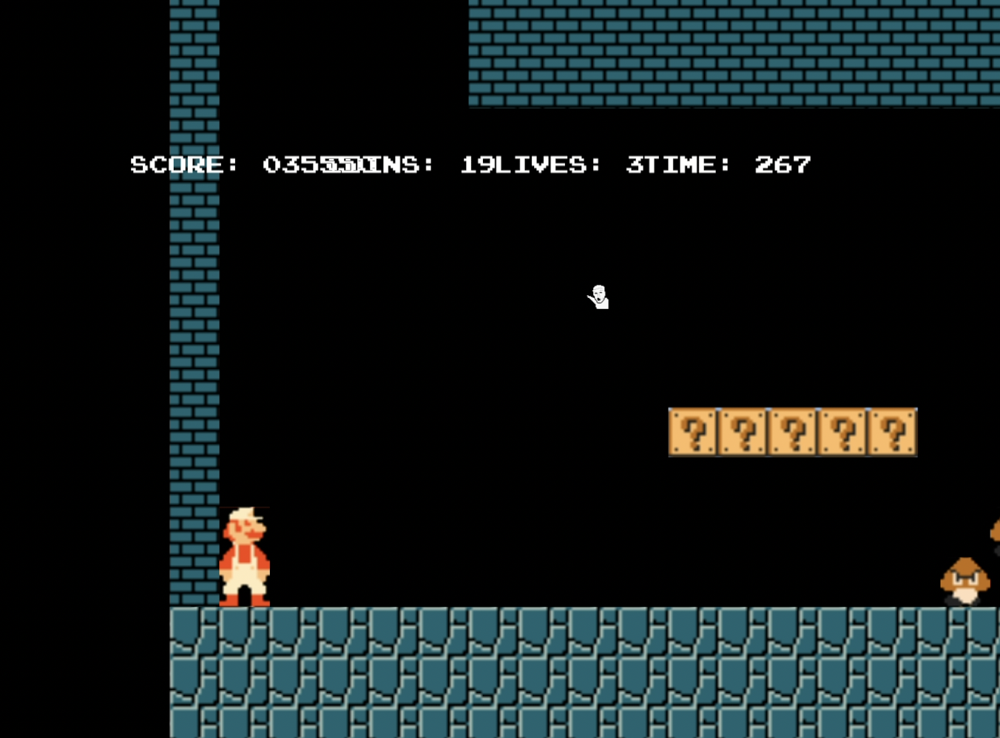 |
| World 1-3（空中平台關卡） | 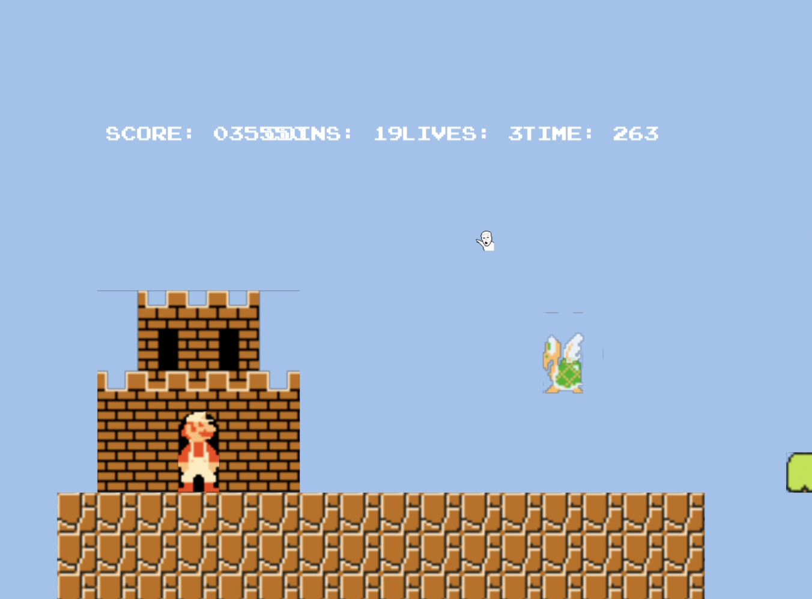 |
| 水管子關卡（隱藏地下金幣房） | 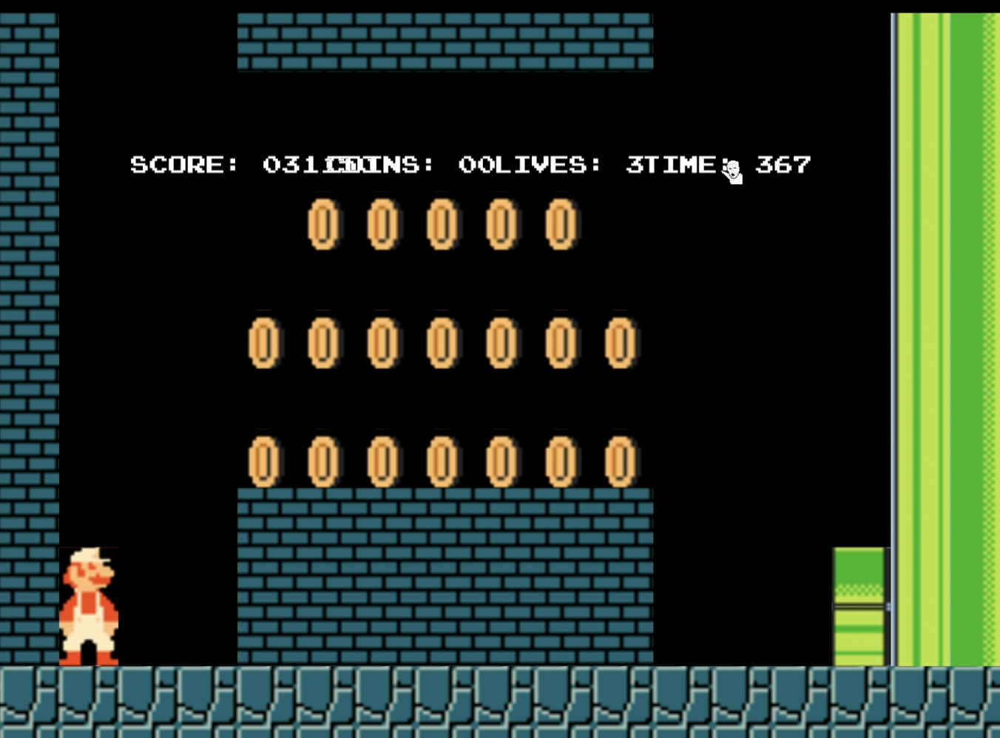 |

#### 關卡完整地圖

**World 1-1（地面關卡）**

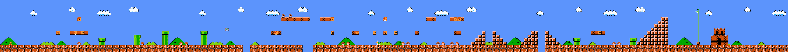

**World 1-2（地下關卡）**

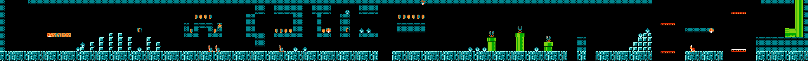

**World 1-3（空中平台關卡）**

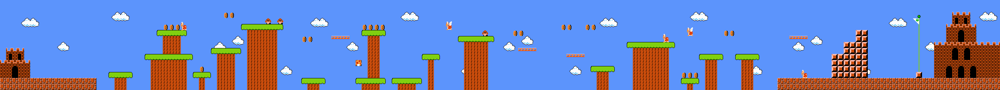

## 程式設計

### 程式架構

整體採物件導向設計，將遊戲物件依職責拆分為角色、磚塊、道具、火球與背景等類別樹，並以多型統一由主迴圈操作。

#### 專案規模

- 標頭檔（`.hpp`）：33 個
- 原始檔（`.cpp`）：7 個（採 header-centric 實作，多數邏輯置於標頭檔）
- 程式碼總行數：約 4,450 行（`src` + `include`，不含 PTSD 框架）
- 主要關卡：3 關（1-1 / 1-2 / 1-3）＋ 子關卡（pipe1 / pipe2）與過場段落
- 馬力歐狀態類別：6 個（3 種變身 ＋ 3 種過場）
- 敵人類別：4 個；道具類別：7 個

#### 1. 遊戲物件繼承樹 (PTSD GameObject)

所有在地圖上看得見的物件，皆繼承自 PTSD 框架的 `Util::GameObject`：

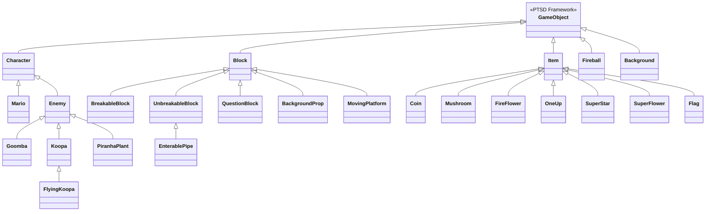

- `Character`：角色基類，提供共用的 `UpdatePhysics`（AABB 物理）。`Mario` 為玩家，`Enemy` 衍生出各式敵人。
- `Block`：所有地圖方塊的基類，含一般／可破壞磚塊、問號磚、背景裝飾、可進入水管與會移動的平台。
- `Item`：所有可拾取道具（金幣、蘑菇、火花、1-UP、星星、超級火花）與終點旗桿 `Flag`。

#### 2. 馬力歐力量型態狀態樹 (MarioState — Strategy Pattern)

馬力歐的變身與過場行為以策略物件封裝，互相可替換：

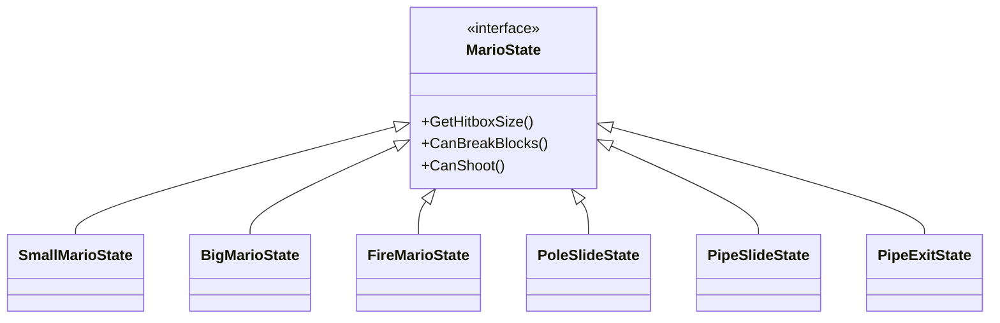

- `Small / Big / FireMarioState`：決定 hitbox 大小、可否撞破磚塊、可否發射火球與對應動畫圖。
- `PoleSlide / PipeSlide / PipeExitState`：旗桿下滑、水管滑入、水管升起等過場專用狀態。
- 另外，馬力歐物件以 `PowerTier`（Small / Big / Fire）獨立記錄變身等級，使其能在過關、水管、旗桿等過場後**正確還原**型態（不會把火花誤判回大馬力歐）。

#### 3. 遊戲狀態流程 (Game State Flow)

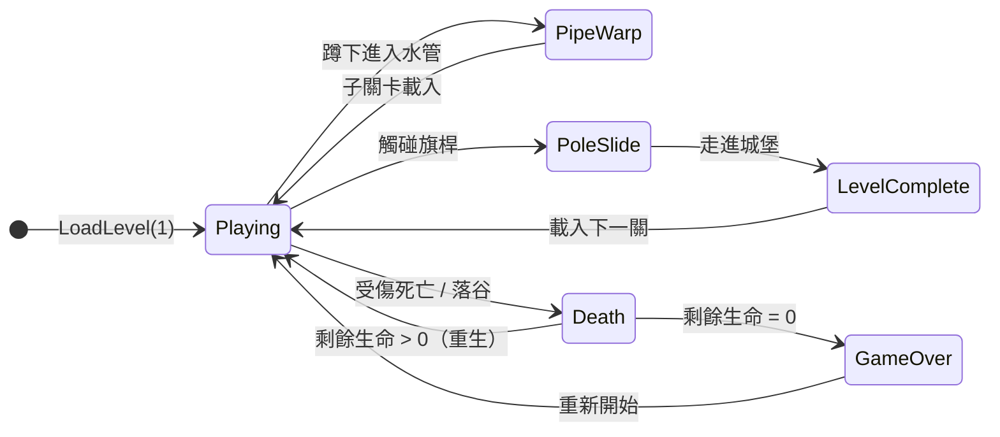

#### 4. 遊戲主迴圈更新流程

`App::Update()` 每一幀都依固定順序執行下列步驟，確保輸入、物理、碰撞、AI 與繪製不會互相影響：

| 步驟 | 名稱 | 職責說明 |
|:---:|---|---|
| 1 | 轉場 / Game Over 檢查 | 處理死亡 bounce、過關轉場與 Game Over 計時 |
| 2 | 倒數計時更新 | 全域時間以 2.5 倍速倒數 |
| 3 | 變身閃爍暫停 | 變身瞬間的閃爍動畫期間凍結遊玩 |
| 4 | 過關 / 死亡判定 | 偵測過關旗標與馬力歐死亡 |
| 5 | 讀取輸入 | 移動、衝刺、跳躍、蹲下、發射火球 |
| 6 | 蹲下狀態解算 | 先於物理解算蹲下，避免延遲一幀 |
| 7 | 水管進入 / 傳送完成 | 偵測水管觸發並在滑行結束後載入目的關卡 |
| 8 | UI 更新 | 分數、金幣、生命、時間 |
| 9 | 磚塊更新 | 含問號磚頂出道具、移動平台 |
| 10 | 馬力歐物理 / 動畫 | `UpdatePhysics` 分軸 AABB 解算與動畫切換 |
| 11 | 落谷死亡判定 | 跌落深谷即死（God Mode 除外） |
| 12 | 火球發射 / 更新 / 出界移除 | 火球更新並在離開視野時移除 |
| 13 | 道具更新（畫面內） | 畫面外道具凍結 |
| 14 | 敵人 AI（畫面內） | 畫面外敵人凍結，不再模擬 |
| 15 | 碰撞互動處理 | `CollisionManager` 集中分派各類碰撞 |
| 16 | 清除失效物件 | 回收已吃掉的道具與失效火球 |
| 17 | 攝影機 / 視野剔除 / 繪製 | 攝影機追隨、剔除畫面外物件後繪製 |
| 18 | Debug / 作弊鍵 | 關卡切換與作弊功能 |

### 程式技術

以下是本專案使用到的物件導向程式技術與設計：

- **物件導向三大特性**：以繼承建立類別樹、以虛擬函式（`UpdateAI`、`OnHit`、`GetSize`、`UpdateRenderPosition` 等）達成多型，讓主迴圈能以統一介面操作所有物件。
- **策略模式 (Strategy Pattern)**：將馬力歐的小／大／火花與各過場行為封裝為可替換的 `MarioState` 子類。計算高度、判斷能否破磚或發射火球時完全不需要寫 `if (isBig)`，全靠多型解決。
- **單例模式 (Singleton Pattern)**：`GameStateManager`、`SFXManager`、`BGMManager` 以單例集中管理分數／金幣／生命／時間、音效與背景音樂。
- **分軸 AABB 碰撞與防卡角**：碰撞偵測以中心點與半寬高比較，並刻意將 X、Y 軸分開解算、於垂直軸縮小 hitbox 寬度 0.2，避免角落卡點與抖動。
- **變身等級保存 (PowerTier)**：在馬力歐物件上保留變身等級，使其能在過關、水管、旗桿等過場後精確還原型態。
- **資料驅動關卡**：地圖以純文字檔描述（每個字元對應一種磚塊／敵人／道具），`BLOCK_SIZE = 16`、原點 `startX=-300, startY=200`；新增關卡或道具磚塊只需擴充字元對應，不需改動核心邏輯。
- **攝影機與效能優化**：實作向右捲動攝影機與垂直視野位移；對畫面外的敵人與道具停止模擬（凍結），並對離開視野的火球即時移除、對畫面外物件做 view culling 以節省繪製。
- **物件生命週期管理**：以 `std::shared_ptr` 管理磚塊、敵人、道具、火球，並於每幀清除失效物件，避免記憶體洩漏與懸置物件。

### 使用到 AI/AI Agent 的部分

本專案在開發後期大量使用 **Claude Code**（Anthropic 推出、以 Claude Opus 為核心的 AI coding agent）作為開發與除錯的輔助工具。與一般「問答式」的 AI 不同，AI agent 能實際讀取整個專案原始碼、理解跨檔案的架構關係，並直接提出診斷與修改方案，再由我審查、整合與驗證。

- **Bug 根因診斷**：AI agent 會閱讀相關原始碼後推斷成因，而非僅依症狀猜測。例如「吃道具後馬力歐橫向位移」被追出是變身時腳陷入地面、又被先做的 X 軸碰撞誤判為側撞；「第三關飛行庫巴位置偏低」被判斷是畫面外物件未凍結導致；「火花變身跨關卡遺失」則是各轉場只用 `isBig` 布林還原所致。
- **功能實作**：在我給定需求後，由 agent 依專案既有風格實作，包含音效串接（受傷、龜殼擊殺、火球命中、特定水管轉場）、外觀像磚塊的隱藏道具磚（含一般與藍色配色）、龜殼撞破磚塊並反彈、作弊系統（無敵／變身循環／星星／加時間／加命），以及火球離開視野即移除等。
- **程式碼理解與導覽**：協助快速定位特定邏輯所在的檔案與函式，並說明子系統之間的互動，降低在程式碼中查找的成本。
- **我與 AI 協作的開發流程**：採「**我下需求與決策、AI 執行、再由我審查**」的模式。對每一項修改，agent 會先說明它對成因的判斷與預期影響，我確認方向正確後才採用，並自行負責編譯與實機測試的最終驗證。整體而言，AI agent 對於「在既有架構中找出 bug 根因」與「依既有風格快速實作」特別有幫助，但無法取代人工驗證，因此清楚的需求描述與逐項審查是有效使用 AI agent 的關鍵。

## 結語

我認為 AI agent 是一個很方便的工具，能夠讓效率大幅提升、減輕許多負擔，但是讓它操作越大的專案越容易出現問題，所以不可能全部交給它處理。

### 問題與解決方法

- **吃道具後馬力歐會橫向位移**
  - **問題**：變身時 hitbox 以中心為基準變高，使腳陷入地面；而物理採「先 X 軸後 Y 軸」解算，會把陷入地面的重疊誤判為側向碰撞，把馬力歐往旁邊推開。
  - **解決方法**：在變身（`ChangeState`）時依新舊高度差調整中心位置，保持雙腳貼地，腳不再陷入地面，側撞誤判也隨之消失。
- **火花型態在過關 / 水管後變回大馬力歐**
  - **問題**：各轉場都只用 `isBig` 布林還原狀態，無法區分「火花」與「大」（兩者 hitbox 同高）。
  - **解決方法**：在馬力歐物件上保存 `PowerTier`（Small / Big / Fire），轉場後以 `ApplyPowerState()` 精確還原型態。
- **第三關飛行庫巴位置偏低**
  - **問題**：畫面外的敵人仍持續模擬，飛行庫巴在玩家看到之前已擺動到上下弧線的最低點。
  - **解決方法**：對畫面外的敵人與道具停止 AI 模擬（凍結），使其進入畫面時維持初始高度。
- **過關或死亡後計時器未重置**
  - **問題**：載入新關卡或重生時沿用上一輪剩餘的時間。
  - **解決方法**：新增 `ResetTime()`，於關卡轉場與死亡重生時重設為 400 秒，但不重設分數與生命。
- **角色卡在磚塊角落 / 抖動**
  - **問題**：AABB 同時解算 X、Y 軸時，角落會互相干擾造成卡點或穿牆。
  - **解決方法**：分開解算兩軸，並於每個軸縮小垂直方向 hitbox 0.2，避免角落誤判，手感更穩定。

### 自評

| 項次 | 項目                   | 完成 |
|------|------------------------|-------|
| 1    | 完成專案權限改為 public |  V  |
| 2    | 具有 debug mode 的功能  |  V  |
| 3    | 解決專案上所有 Memory Leak 的問題  |  V  |
| 4    | 報告中沒有任何錯字，以及沒有任何一項遺漏  |  V  |
| 5    | 報告至少保持基本的美感，人類可讀  |  V  |

### 心得

- **113820016 林稚蓁**
  - 這是我人生第一次設計遊戲，對於這次的感想，我深度體會到助教開學那句話「要把流程寫清楚」。當初我並不認真處理這份作業，導致我中途手忙腳亂，我認為這是一個很好的教訓。而且，當東西越來越多時，看著密密麻麻的程式會讓人頭昏眼花，再加上如果沒有好好整理思緒，很容易讓自身效率降低。我認為這次 OOP 的成果並不好，也許只能給勉強及格，與原版相比，在遊戲性能優化以及物件數量上相差遙遠，但在過程中我反思與詢問 AI，讓我對遊戲設計有更深刻的了解，如果還有下次，我會更有頭緒如何做得更好。

### 貢獻比例

| 組員 | 貢獻度 |
|:---:|:---:|
| 113820016 林稚蓁 | 100% |
