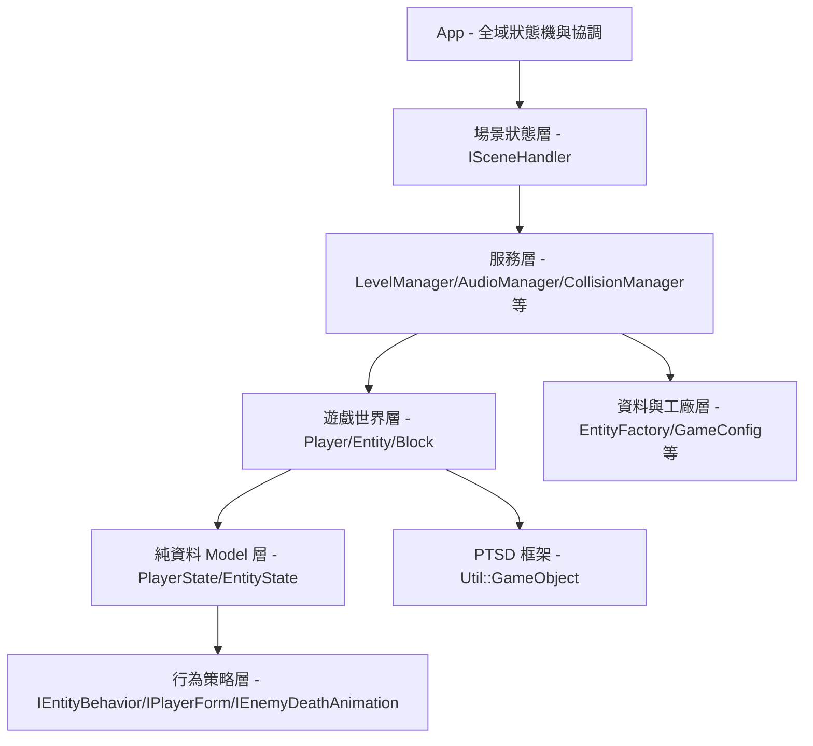
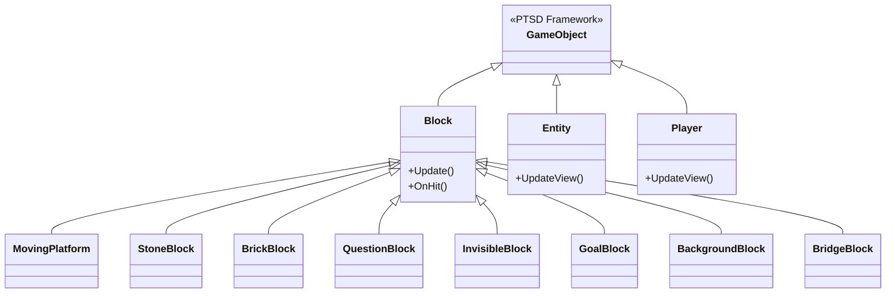
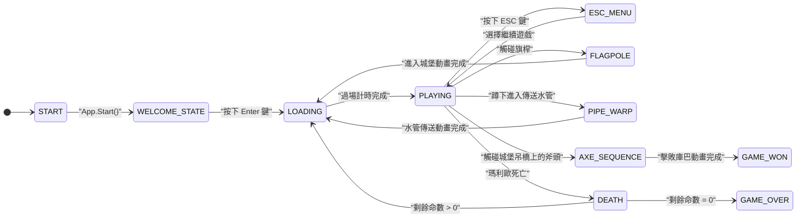
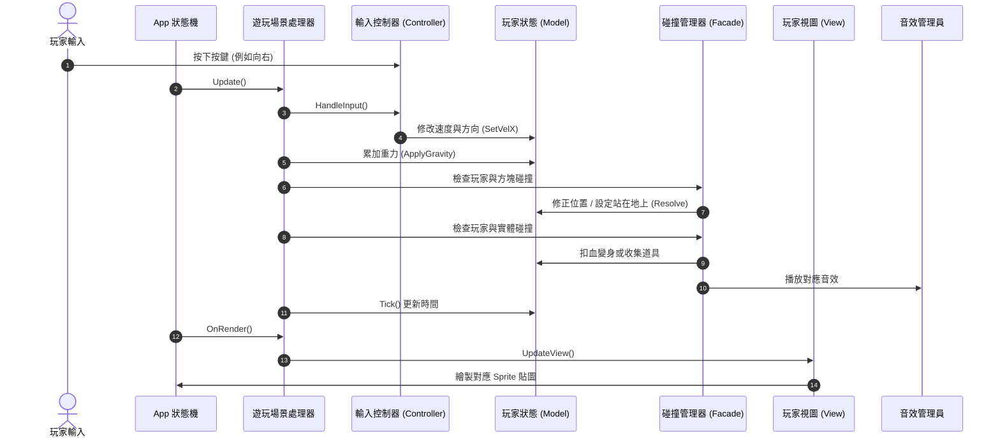

# 2026 OOPL Final Report

## 組別資訊

- 組別：T43
- 組員：113820033 謝奕宏
- 復刻遊戲：Super Mario Bros. (FC / NES, 1985)

## 專案簡介

### 遊戲簡介

- 這次期末專案我是使用助教提供的 PTSD 遊戲框架，以 C++17 來復刻大家最經典的 2D 橫向捲軸動作遊戲《超級瑪利歐兄弟》（Super Mario Bros.）。
- 遊戲中我完整還原了玩家的操控體驗：除了基本的左右移動、跳躍和踩踏敵人，也實作了吃紅香菇變大、吃火焰花發射火球，以及吃無敵星星進入閃爍無敵狀態等經典變身機制。
- 關卡方面我實作了三個不同風格的代表性關卡：分別是大家最熟悉的起點 **World 1-1（地面關卡）**、難度逐漸提升的 **World 1-2（地下關卡）**，以及挑戰難度最高的 **World 8-4（城堡關卡）**。玩家需要運用各種道具與動作技巧，穿越重重障礙與不同的敵人，最後在城堡深處擊敗 Boss 庫巴（Bowser）救出公主。

### 組別分工

- 因為本組為單人組別，所以這款瑪利歐遊戲從無到有的所有開發與設計工作，皆由我一個人獨自完成。
- 具體工作包含：程式架構規劃與設計模式套用、核心物理碰撞邏輯、關卡地圖 CSV 設計與生成、敵人 AI 行為系統、UI 與音效整合，以及期末報告撰寫和開發輔助工具腳本的編寫。

## 遊戲介紹

### 遊戲規則

#### 🎮 操作方式

<!--  -->

| 按鍵 | 功能 |
|:---:|---|
| `← →` 或 `A` `D` | 左右移動 |
| `↑` 或 `W` 或 `Space` | 跳躍（按住越久跳越高） |
| `↓` 或 `S` | 蹲下（大瑪利歐、火焰瑪利歐） |
| `LShift` | 加速跑步 |
| `E`  | 發射火球（火焰瑪利歐型態） |
| `ESC` | 開啟暫停選單（變身 / 外掛 / 關卡跳轉） |
| `Enter` | 開始遊戲 / 確認選單 |

---

#### ⭐ 力量型態 (Power State)

| 圖示 | 型態 | 說明 |
|:---:|:---:|---|
|  | **小瑪利歐 (Small)** | 最基本的狀態，只要被怪物碰到就會直接死亡。 |
|  | **大瑪利歐 (Big)** | 吃紅香菇變大，可以撞碎磚塊。碰到怪物會變回小瑪利歐，多一次容錯機會，不會直接死亡。 |
|  | **火焰瑪利歐 (Fire)** | 吃火焰花變身，可以按 `E` 鍵發射火球來打倒怪物。 |
|  | **無敵星星 (Star)** | 吃星星後身上會閃爍無敵，可以直接撞飛碰到的所有怪物。 |

---

#### 👾 敵人介紹

| 圖示 | 名稱 | 特性 |
|:---:|:---:|---|
|  | **栗寶寶 (Goomba)** | 最普通的怪物，只會左右巡邏、撞到牆壁就回頭。可以用跳躍踩扁牠，或用火球打飛。 |
|  | **烏龜兵 (Koopa)** | 踩一下會縮進龜殼裡。如果把龜殼踢飛，可以順便撞飛路上其他怪物。 |
|  | **飛天龜 (ParaKoopa)** | 長了翅膀的烏龜，會上下飛行。踩一下翅膀會掉下來，變成一般的烏龜。 |
|  | **擲斧烏龜 (AxeKoopa)** | 8-4 關卡的敵人，會避開懸崖，還會朝著玩家走並丟斧頭，有點難纏。 |
|  | **Boss 庫巴 (Bowser)** | 最後的大 Boss。具有 5 階段 AI 動作（巡邏、噴火、跳躍、受傷、死亡）。需要多發火球才能打倒牠，或者可以直接繞到後面砍斷吊橋的斧頭，讓牠掉進岩漿。 |
|  | **食人花 (Piranha Plant)** | 躲在水管裡的植物，會定時伸出來。如果玩家站太近，牠就不會伸出來（有安全距離偵測，防偷襲）。 |
|  | **岩漿泡泡 (Podoboo)** | 從岩漿定時跳上來的岩漿泡泡，無法踩踏，只能想辦法閃過去。 |

---

#### 🎁 道具介紹

| 圖示 | 名稱 | 效果 |
|:---:|:---:|---|
|  | **紅香菇 (Mushroom)** | 讓瑪利歐變大隻，可以敲碎磚塊。 |
|  | **火焰花 (Fire Flower)** | 讓瑪利歐變成火焰型態，可以發射火球打怪。 |
|  | **無敵星星 (Star)** | 短時間內變成無敵狀態，碰到怪物直接撞飛。 |
|  | **綠香菇 (1-UP)** | 就是 1-UP 香菇，吃了可以多一條命。 |
|  | **金幣 (Coin)** | 吃金幣加分，集滿 100 個金幣就可以多加一條命。 |

---

#### 🗺️ 關卡流程

```
World 1-1 (地面關卡)
    ↓ 觸碰旗桿
World 1-2 (地下關卡 — 有 食人花 與 移動平台)
    ↓ 蹲入傳送水管
World 8-4 (庫巴城堡 — 有 城堡火焰 與 Boss 庫巴)
    ↓ 踩下橋頭斧頭
★ 通關！拯救公主！
```

---

#### 🕹️ 外掛模式 (Cheat Mode / Debug Mode)

按 `ESC` 叫出暫停選單，可開啟以下外掛功能：

| 功能 | 說明 |
|---|---|
| 自由變身 | 在暫停選單裡可以隨時切換成小、大或火焰瑪利歐。 |
| 無限無敵星星 | 讓瑪利歐一直保持無敵星星的閃爍狀態。 |
| 火球射擊能力 | 不管是小隻還是大隻的瑪利歐，都可以發射火球。 |
| 虛空救援 | 掉到懸崖或洞裡時，會自動被救起來，傳送回剛剛跳過來的平台。 |

---

#### 💡 遊戲機制補充

| 機制 | 說明 |
|---|---|
| **生命系統** | 一開始有 3 條命。掉進懸崖、被怪物撞到、或是時間到了都會扣 1 條命。命扣完就 Game Over。 |
| **時間限制** | 每關有 400 秒限制。時間低於 100 秒時背景音樂會自動變快，提醒玩家快點通關。 |
| **踩踏連擊** | 腳不落地連續踩怪物的話，拿到的分數會一直加倍（從 100 翻倍到 1000 分）。 |
| **金幣獎命** | 只要集滿 100 個金幣，就會自動送 1 條命。 |

---

### 遊戲畫面

| 階段 | 遊戲畫面 |
|:---:|:---:|
| 關卡 1-1 (地面世界) |  |
| 關卡 1-2 (地下世界) |  |
| 關卡 8-4 (庫巴城堡) |  |
| 開始畫面 (Title Screen) |  |
| 關卡過場 (Loading Scene) |  |
| 控制說明 (Control Guide) | |
| 暫停與外掛選單 (ESC Menu) |  |
| 主角變身 (大瑪利歐) |  |
| 主角變身 (火焰瑪利歐) |  |
| 主角變身 (無敵星星) |  |
| 作弊模式 (Cheat / Debug Mode) |  |
| 踩踏敵方 (Stomp Goomba) |  |
| 拉旗子 (Flagpole) |  |
| 食人花 (Piranha Plant) |  |
| 庫巴 Boss 戰 (Bowser Battle) |  |
| 遊戲結束 (Game Over Screen) |  |
| 拯救公主 (Game Won Screen) |  |
| 遊戲通關 (Game World Cleared) |  |

## 程式設計

### 程式架構

在這次的程式設計中，我花了很多心思把原本混在一起的程式碼（God Class）徹底拆開，改成更符合物件導向原則的架構。我使用了 C++17 來開發，並大量使用了繼承、多型與多種設計模式。

以下是整個專案的規模與系統分層：

#### 專案規模

- 標頭檔 (`.hpp`)：85 個
- 原始檔 (`.cpp`)：68 個
- 程式碼總行數：約 18,500 行（C++ 實作原始碼，不含 PTSD 框架）
- 設計模式使用數量：**10 種**
- 實體行為策略子類 (`IEntityBehavior`)：20 個
- 輸入動作命令子類 (`ICommand`)：12 個
- 場景狀態子類 (`ISceneHandler`)：10 個
- 方塊子類 (`Block`)：9 個
- 玩家型態子類 (`IPlayerForm`)：5 個

#### 系統分層架構圖

我將整個專案分為多個層級，從最上層的 App，到場景控制、服務層、遊戲世界物件、行為策略，以及最底層的資料工廠：



#### 核心類別繼承關係與說明

為了讓大家方便看懂，我畫了幾個核心的繼承關係圖：

##### 1. 遊戲物件繼承樹 (PTSD GameObject)

所有在地圖上看得見的物體，我讓它們都繼承自 PTSD 框架的 `Util::GameObject`：



- `Util::GameObject`：PTSD 中的遊戲基礎物件。
- `Player`：玩家的 View 顯示類別，負責依據狀態更新 Mario 的 Sprite 渲染。
- `Entity`：所有實體（敵人、道具、火球等）的 View 顯示類別。
- `Block`：所有地圖方塊的基類，包含：`BrickBlock` (一般磚塊)、`QuestionBlock` (問號方塊)、`StoneBlock` (石頭地基)、`InvisibleBlock` (隱形方塊)、`GoalBlock` (終點旗桿底座)、`BackgroundBlock` (背景物件)、`BridgeBlock` (庫巴橋樑)、`MovingPlatform` (會移動的平台)。

##### 2. 場景切換狀態樹 (ISceneHandler)

為了避免 switch-case 爆炸，我用 State Pattern 做了場景管理，每一個畫面都繼承自 `ISceneHandler`：

- `TitleSceneHandler`：標題選單畫面。
- `LoadingSceneHandler`：關卡過場載入畫面（會顯示剩餘命數）。
- `PlayingSceneHandler`：主要遊玩畫面，裡面有非常嚴謹的每幀更新流程。
- `FlagpoleSceneHandler`：瑪利歐滑下旗桿並走進城堡的過場動畫。
- `PipeWarpSceneHandler`：瑪利歐蹲下進入水管的傳送動畫。
- `AxeSequenceSceneHandler`：瑪利歐砍斷城堡吊橋、庫巴落水死亡的劇情動畫。
- `DeathSceneHandler` / `GameOverSceneHandler` / `GameWonSceneHandler`：死亡、遊戲結束、通關祝賀畫面。
- `ESCMenuSceneHandler`：暫停選單與外掛開啟介面。

##### 3. 實體行為策略樹 (IEntityBehavior)

所有敵人與道具的 AI 邏輯，我全部抽出來做成 Strategy Pattern，繼承自 `IEntityBehavior`，並引入了 `EnemyBehavior` 和 `ItemBehavior` 作為多型中間基類以解耦碰撞與踩踏邏輯：

- `IEntityBehavior`：最上層策略介面。
  - `EnemyBehavior`：敵對實體抽象基類，實現通用踩踏得分 combo、Star 無敵擊殺與傷害邏輯。
    - `GoombaBehavior`：栗寶寶的左右巡邏與被踩扁行為。
    - `KoopaBehavior`：烏龜兵的巡邏、被踩後縮入龜殼、以及被踢飛的行為。
    - `ParaKoopaBehavior`：飛天龜的正弦波飛行行為。
    - `AxeKoopaBehavior`：擲斧烏龜的避坑、主動跳躍與投擲斧頭。
    - `BowserBehavior`：Boss 庫巴的五階段 AI（巡邏、吐火球、跳躍、受傷、被擊敗）。
    - `PiranhaPlantBehavior`：食人花的伸縮與安全範圍判定。
    - `PodobooBehavior`：岩漿泡泡定時向上跳躍。
    - `FireballBehavior`（庫巴火球）：火球的拋物線彈跳與碰撞爆炸。
    - `AxeProjectileBehavior`（庫巴投擲斧）：投射軌跡與傷害判定。
  - `ItemBehavior`：收集型道具抽象基類，委派至多型收集邏輯。
    - `MushroomBehavior` / `FireFlowerBehavior` / `StarBehavior` / `OneUpBehavior` / `CoinBehavior`：各種道具從方塊中升起、移動與被吃掉的行為。
    - `AxeBehavior` / `PrincessBehavior` / `FlagBehavior`：城堡斧頭、拯救公主與終點旗桿過場行為。
  - `DefaultEntityBehavior` / `ParticleDebris` / `CastleFireSpawnerBehavior`：預設被動行為、磚塊碎屑粒子與8-4城堡的火焰生成行為。

##### 4. 玩家力量型態狀態樹 (IPlayerForm)

我使用 State Pattern 處理 Mario 變身狀態：

- `IPlayerForm`：力量型態介面。
  - `SmallPlayerForm`：小瑪利歐狀態。
  - `BigPlayerForm`：大瑪利歐狀態。
  - `FirePlayerForm`：火焰瑪利歐狀態。
  - `SmallStarPlayerForm` / `BigStarPlayerForm`：小/大瑪利歐的無敵星星狀態。

#### 遊戲狀態轉移圖 (App State Machine)

這是整個遊戲主程式的狀態機運作流程：



#### 遊戲主迴圈 — 17 Phase 架構

當我在寫主要遊玩畫面 (`PlayingSceneHandler`) 時，為了確保物理碰撞、輸入、AI、粒子特效等的執行順序不會出錯，我把每一幀的更新分成了 17 個嚴格的步驟：

| Phase | 名稱 | 職責說明 |
|-------|------|------|
| 0 | ESC CHECK | 偵測 ESC 鍵，是否需要切換到暫停選單 |
| 1 | PROCESS INPUT | 透過 `InputHandler` 讀取鍵盤狀態 |
| 2 | UPDATE PHYSICS | 累加重力速度與物理運算 |
| 3 | APPLY POSITION | 位置積分更新（計算新的 X 與 Y 軸位置） |
| 4 | COLLISION DETECT | 進行玩家與地圖方塊的三步驟碰撞偵測與修正 |
| 5 | SPAWN ITEMS | 處理被方塊敲擊所產生的道具生成動畫 |
| 6 | PLAYER STATE TICK | 更新瑪利歐的計時器與動畫影格 |
| 7 | ENTITY AI UPDATE | 呼叫所有實體的 AI 更新以及實體與方塊的碰撞偵測 |
| 8 | ENTITY TICK+VIEW | 更新實體的計時器與視圖渲染狀態 |
| 9 | PLAYER-ENTITY COL | 偵測玩家與怪物/道具之間的碰撞 |
| 10 | ENTITY-ENTITY COL | 偵測實體與實體（例如火球打怪、龜殼砸怪）的碰撞 |
| 11 | AXE/FLAG/PIPE | 檢查特殊碰撞（是否碰到旗桿、斧頭或要傳送的水管） |
| 12 | CAMERA + BLOCKS | 攝影機追隨玩家，並更新畫面內方塊狀態 |
| 13 | BRICK DEBRIS | 生成敲碎方塊時的磚塊碎片粒子效果 |
| 14 | PLAYER VIEW | 更新玩家的貼圖顯示與無敵狀態下的閃爍特效 |
| 15 | GAME TIMER | 全域遊戲時間計時，並在低於 100 秒時更換加速音樂 |
| 16 | PIT-FALL + DEATH | 偵測玩家是否掉進懸崖，並觸發死亡或外掛救援 |
| 17 | CLEANUP | 清除已經死掉的敵人或已被吃掉的道具物件 |

#### MVC 每幀運作序列圖

這是我實作的 MVC（Model-View-Controller）模式在每一幀的運作流程：



### 程式技術

以下是我在寫這個瑪利歐專案時，所使用到的物件導向程式技術與設計模式：

- **狀態模式 (State Pattern) 控制場景與玩家力量**
  - **場景控制**：我本來把所有畫面的 switch-case 都寫在 `App.cpp` 裡，但這樣檔案變得超大。後來我用 State Pattern 建立了 `ISceneHandler` 介面，把標題畫面、載入中、遊戲中、暫停選單等畫面各寫成獨立的類別。這樣 App 的 `Update` 就只需要呼叫當前狀態的 `Update`，整潔了許多，未來要加新畫面也很方便。
  - **力量變身**：瑪利歐有小隻、大隻、火球、無敵等多種型態。我設計了 `IPlayerForm` 介面與五種對應的狀態類別。每次變身或受傷時，我只要讓狀態機回傳新的型態物件即可。這樣在計算瑪利歐的高度或是判斷能不能發射火球時，完全不需要寫 `if (isBig)` 這種判斷，全靠多型解決。
- **策略模式 (Strategy Pattern) 實作敵人 AI**
  - 我本來在處理敵人行為時，寫了大量的 `if (type == Goomba)` 分支。為了解耦，我將每種實體的行為封裝成繼承自 `IEntityBehavior` 的策略類別。現在 `Entity` 只是個顯示載具，它身上持有一個 Behavior 晶片，例如 Goomba 裝 `GoombaBehavior`，飛天龜被踩到沒翅膀時，我只要把它的 Behavior 晶片當場換成 `KoopaBehavior` 即可，不需要重新 `new` 一個物件，彈性非常好。
- **工廠模式 (Factory Pattern) 統一生成物件**
  - 為了避免程式碼中到處都是 `new Entity(...)`，我寫了 `EntityFactory` 來統一處理實體的建立。當需要生成怪物或道具時，呼叫端只需要告訴工廠類型與座標，工廠就會自動幫它設定好 Z-Index、碰撞箱、載入貼圖並注入對應的 AI 行為，非常省事。
  - 另外我也寫了 `EnemyDeathStyleFactory`，根據敵人的死法（被踩扁、被火球擊飛等）來動態決定它要播放哪種死亡動畫策略。
- **門面模式 (Facade Pattern) 重構碰撞系統**
  - 碰撞系統是我花最多時間的地方。一開始所有物件的碰撞判斷都混在 `CollisionManager` 中，多達 800 行且非常容易出 bug。後來我把它做成 Facade 模式，只當作一個分派櫃檯，底下分拆成 `PlayerBlockHandler`、`PlayerEntityHandler`、`EntityBlockHandler` 和 `EntityEntityHandler` 四個子處理器，分別管不同類型的碰撞。這樣我修 bug 時就不會互相影響。
- **依賴反轉 (DIP) 與服務定位器 (Service Locator)**
  - 為了讓跨模組調用服務（像是播放音效、讀取地圖）更方便，我建立了 `ServiceLocator` 來管理所有全域服務。我先定義好 `IAudioService` 和 `ILevelService` 的介面，並將實作註冊進去。這樣其他類別只需要透過 `ServiceLocator::GetService<T>()` 就能拿到服務，不需要把各個 Manager 的指標傳來傳去。
- **範本方法模式 (Template Method Pattern) 設計方塊**
  - 我設計了方塊基底類別 `Block`，定義了方塊被撞擊時的固定流程（播放彈跳動畫、更換貼圖狀態等），並開出一個 `virtual HandleOnHit()` 的虛擬函式。像問號方塊和磚塊等子類別只需要實作這個 `HandleOnHit` 去生金幣或碎裂即可，重複的流程都被鎖在基類中，符合 DRY 原則。
- **命令模式 (Command Pattern) 解耦輸入動作**
  - 為了讓輸入系統符合 OCP 與 DIP，我設計了 `ICommand` 介面，把每一個「玩家動作」（移動、跳躍、蹲下、射火球等）各自封裝成一個獨立的命令類別，共 12 個。`InputHandler` 在每幀結合 `IInputProfile` 策略讀取到的按鍵狀態，選擇並執行對應的 `ICommand::Execute(state, level)`，自身完全不需要知道各個動作的具體邏輯。未來若要新增輸入動作，只需新增一個 `ICommand` 子類，核心控制器一行都不用改。
- **登錄表模式 (Registry Pattern) 取代 EntityFactory switch-case**
  - 最初 `EntityFactory` 裡有一個巨大的 `switch(entityType)` 分支，每次我要新增一種怪物行為，就必須進去找到這段核心代碼才能新增 case，這嚴重違反了 Open-Closed Principle（OCP）。為了解決這個問題，我引入了 `BehaviorRegistry` 登錄表，它內部維護一個 `std::unordered_map<EntityType, Creator>` 映射表，在程式啟動時一次性登錄所有行為的建立 lambda。現在 `EntityFactory` 只需要呼叫 `BehaviorRegistry::Create(type, def)` 即可，核心代碼完全不用隨怪物種類的增加而修改！
- **固定時步系統 (Fixed Timestep) 確保物理一致性**
  - 遊戲的物理更新頻率應該與繪製幀率解耦，否則在不同性能的電腦上，Mario 的跳躍高度和移動速度會有差異。我設計了 `FixedTimestep` 類別作為固定時步累積器，它將實際的幀時間（dt）累積後切割成固定大小的物理 tick（20ms = 50FPS），並設有最大幀時間硬限制來防止長時間卡頓後產生的「死亡螺旋（Spiral of Death）」問題。
- **SRP 動畫解析器 (PlayerAnimator / EntityAnimator)**
  - 隨著玩家和實體的狀態越來越複雜（變身、死亡動畫、無敵閃爍等），Sprite 路徑的解析邏輯開始侵入 `Player.cpp` 和 `Entity.cpp` 的渲染代碼中，讓 View 類別承擔了不屬於它的職責。為了遵守 SRP（單一職責原則），我將這段邏輯抽取出來，各自設計了 `PlayerAnimator` 和 `EntityAnimator` 兩個輔助解析器類別，讓 View 類別只負責「呼叫解析器取得路徑，然後更新 Sprite 渲染」，不再自己決定動畫邏輯。
- **Viewport Culling (視口剔除) 優化渲染效能**
  - 瑪利歐的地圖非常長，如果每一幀都把所有的方塊和怪物拿去畫，效能會非常差。因此我實作了視口剔除，在 `Level` 更新和渲染時，我會先計算當前攝影機的位置，只去渲染和更新在畫面可見範圍內的方塊與實體，大大提升了 FPS。
- **Sprite Path Cache (貼圖路徑快取)**
  - 遊戲中如果每次更新 Sprite 都去讀取硬碟，會有很嚴重的 I/O 延遲。我設計了 `SpritePathResolver`，裡面用 `std::unordered_map` 把解析過的路徑快取起來，第二次之後讀取貼圖就能直接從記憶體拿，避免掉幀。
- **CSV 資料驅動關卡**
  - 我把地圖的設計全部做成 CSV 檔（如 `1-1.csv`），並用 `IDList.csv` 和 `EntityList.csv` 來定義方塊和實體的代號。這樣我不需要在程式碼中寫死地圖，只要改 CSV 檔案就能直接改變關卡的設計，實作了資料驅動。

### 使用到 AI/AI Agent 的部分

在開發這個專案的過程中，我主要與 AI 程式助理 GitHub Copilot，以及 Gemini Antigravity 和 Claude 等大型語言模型進行協作。以下是我如何與這些 AI 工具分工與協作的心得：

- **架構發想與重構建議**：當我遇到 God Class 義大利麵程式碼崩潰的時候，我請 AI 幫我分析並給予重構建議。AI 幫我提出了使用 State Pattern 拆解 App 和 IPlayerForm，以及使用 Strategy Pattern 拆解 AI 行為的點子。我根據它的點子，畫出 UML 繼承圖，定義好類別介面後，再由我引導 AI 寫出具體實作。
- **輔助撰寫核心程式碼**：在定義好 `IEntityBehavior` 和 `ISceneHandler` 的空殼後，我讓 AI 協助生成一些重複性高但繁瑣的實作，例如 20 種 Behaviors 的具體狀態邏輯，以及 10 個場景狀態的跳轉流程，大幅節省了我的打字時間。
- **協助除錯與優化效能**：在碰撞物理管線調優的過程中，瑪利歐常會出現卡牆或抖動的 Bug，我把程式碼片段和 Bug 狀況貼給 AI，AI 幫我分析出是物理 Snap 的順序問題（必須先做 FallDetect，再做 BodyResolution），並提供了 Viewport Culling 的優化邏輯，幫助我解決了效能瓶頸。
- **自動化工具腳本**：為了快速編輯 8-4 的 CSV 地圖與裁切 Sprite 圖片，我請 AI 幫我用 Python 寫了小工具腳本，讓地圖產生的工作快了許多。
- **我與 AI 協作的開發流程**：
  我嚴格遵守著「架構設計先行」的原則。每次做重大修改前，我都會先整理好我的 implementation_plan 檔案，確認邏輯沒問題才動手。我也會及時更新 Constructure.md 確保架構與程式碼同步。

## 結語

### 問題與解決方法

- **最初的 God Class 義大利麵程式碼**
  - **問題**：剛開始寫的時候，我把遊戲的邏輯、畫面繪製、碰撞判斷和敵人 AI 全塞在 `App.cpp` 裡，導致程式碼變得非常長（幾千行），稍微修改一個地方別的地方就會壞掉，完全無法維護。
  - **解決方法**：我痛定思痛進行重構，導入 **State Pattern** 將 `App` 解耦。我建立了 10 個 `ISceneHandler` 子類別，將各個畫面的邏輯移出去。現在 `App::Update()` 只需要兩行，其他全交給當前的場景處理器去跑。
- **碰撞系統太過混亂**
  - **問題**：原先 `CollisionManager.cpp` 塞了 800 行程式碼，混合處理玩家、方塊、怪物和火球之間的各種碰撞，經常發生修改了玩家碰撞卻導致怪物掉出地圖的 bug。
  - **解決方法**：我導入 **Facade Pattern**，將碰撞管理器當作單一分派櫃檯，並將具體的碰撞判斷拆分到 `PlayerBlockHandler`、`PlayerEntityHandler`、`EntityBlockHandler` 和 `EntityEntityHandler` 四個處理器中，讓它們各司其職，修 bug 時不會再互相干擾。
- **新增敵人需要修改大量舊程式碼**
  - **問題**：一開始每種怪物的行為都用 `if (type == Goomba)` 判斷，導致如果我想新增飛天龜或 Boss 庫巴，就得去好幾個檔案裡加一堆 if-else，非常痛苦。
  - **解決方法**：我使用 **Strategy Pattern**，讓 `Entity` 只有一個 `IEntityBehavior` 策略指標。我把 20 種實體行為各自寫成獨立的類別，新增怪物時只需要寫一個新的 Behavior 並註冊到 `EntityFactory` 裡，核心代碼完全不用修改。
- **EntityFactory 的 switch-case 違反 OCP**
  - **問題**：`EntityFactory::SpawnEntity()` 中有一個巨大的 `switch(entityType)` 分支，每次新增一種怪物就得進去加一個 `case`，直接修改 Factory 核心邏輯，嚴重違反了 Open-Closed Principle（對擴充開放、對修改封閉）。
  - **解決方法**：我引入了 **BehaviorRegistry（登錄表模式）**。它維護一個 `std::unordered_map<EntityType, Creator>` 映射表，在初始化時一次性登錄所有行為的建立 lambda。此後 `EntityFactory` 只需呼叫 `BehaviorRegistry::Create(type, def)`，完全不需要知道各行為的細節，新增怪物行為**完全無需修改 Factory 一行代碼**！
- **瑪利歐力量變身的 if-else 爆炸**
  - **問題**：瑪利歐有小隻、大隻、火球、無敵等狀態，這些狀態的碰撞高度、能不能丟火球、動畫路徑等邏輯散落在 PlayerState 中，充斥著各種 if-else。
  - **解決方法**：我導入 **State Pattern (IPlayerForm)**，把 5 種變身型態拆成獨立的類別。現在瑪利歐吃香菇變大時，狀態機直接回傳 `BigPlayerForm` 物件。物理引擎和動畫要取得高度時直接呼叫 `m_Form->GetHeight()` 即可，免去了所有 if-else 判斷。
- **向下轉型 (dynamic_cast) 造成的效能與架構污染**
  - **問題**：在切換場景時，我原本為了傳遞特定參數（像是玩家在水管的傳送方向或旗桿座標），使用了 `dynamic_cast` 將 `ISceneHandler` 轉型成具體的 Handler，這在 OOP 中是不良的設計。
  - **解決方法**：我改用 **Self-Configuring** 與 **GameState DTO**。讓 `FlagpoleSceneHandler` 自行去跟 `LevelService` 查旗桿座標，而水管傳送參數則存在 `GameStateManager` 的資料傳輸物件中，成功在整個 C++ 專案中清除了所有 `dynamic_cast`。
- **碰撞物理管線極度敏感，容易卡牆或抖動**
  - **問題**：在移植瑪利歐碰撞時，我發現如果碰撞解析的順序不對，玩家很容易卡在磚塊裡、抖動或是穿牆。
  - **解決方法**：我研究後實作了嚴謹的三步驟碰撞物理管線：第一步 `FallDetect` 偵測腳下是否有踩到東西；第二步 `CeilingTrigger` 偵測頭頂是否撞到磚塊；第三步 `BodyResolution` 依據下、右、左、上的順序去 Snap 邊界。經過多輪調優，手感終於跟原版一致。

### 自評

| 項次 | 項目                   | 完成 |
|------|------------------------|-------|
| 1    | 完成專案權限改為 public |  V  |
| 2    | 具有 debug mode 的功能  |  V  |
| 3    | 解決專案上所有 Memory Leak 的問題  |  V  |
| 4    | 報告中沒有任何錯字，以及沒有任何一項遺漏  |  V  |
| 5    | 報告至少保持基本的美感，人類可讀  |  V  |

### 心得

- **113820033 謝奕宏**
  - 這學期的物件導向程式設計實習（OOPL）對我而言，是一次極具收穫的程式實作經歷。這不僅僅是完成了復刻《超級瑪利歐兄弟》這款遊戲本身，更讓我對「物件導向設計」與「人機協作」有了全新的理解與體會。
  - **從「AI 魔法」到「義大利麵地獄」**：剛開始開發這個瑪利歐專案時，我其實蠻放鬆的，甚至有點樂觀。我想著：「反正現在有 GitHub Copilot 和 Gemini Antigravity 這些超強的 AI 工具，我只要用口語描述需求，程式碼就能自動生成，寫專案應該很輕鬆吧！」（現在回想起來，當時真的是完全低估了大型專案的複雜度）。確實，開發前幾天非常順暢，給個指令 AI 就能產出大量程式碼，瑪利歐也真的能跑能跳，看起來有模有樣。但因為當時我太過依賴 AI 的即時產出，沒有事先規劃整體的 OOP 架構，導致程式碼在不知不覺中糾纏在一起，充斥著數百個 if-else 和硬編碼（Hard-coding），寫出了一大坨很難維護的義大利麵程式碼。隨著專案規模擴大，真正的考驗來了：當我想新增水管傳送或 World 8-4 的 Boss 關卡時，程式架構開始全面崩潰。隨便改個地方其他功能就跟著壞掉，處處都是牽一髮動全身的死結。那幾天光是解決各種 Bug 就花了大半時間，看著幾千行糾纏在一起的程式碼，真的很令人頭痛。
  - **架構重構的轉折點**：在無數次卡關之後，我決定停下鍵盤好好思考，才發現自己本末倒置了。AI 寫程式的速度確實很快，但它沒有辦法幫你規劃整個專案的架構。如果開發者自己沒有事先想好類別的繼承關係、介面定義和設計模式，走一步算一步叫 AI 寫，最後拼湊出來的就只會是外表好看、內部卻一團亂的程式碼。於是我決定把之前寫爛的程式碼砍掉重練。我拿了平板靜下心來把所有的類別關係圖畫出來：重新分析物件的共通性、繼承樹該怎麼長，以及如何利用多型來解耦不同的狀態。在定義好清晰的介面和框架之後，我才把具體的細節交給 AI 來協助實作。這次的重構效果非常明顯：程式碼變得井然有序，每個模組各司其職，之前改一個地方壞另一個地方的狀況幾乎不再出現。
  - **設計模式與 OOP 架構的實戰體會**：經過這次的折騰，我才體會到課本上教的「設計模式」真的不是為了考試，而是實際開發時的救星。特別是下面這幾個設計，在專案中幫了我大忙：
    - **物件創造的「點餐櫃檯」（Factory Pattern）**：以前要產生一個怪物或道具，程式碼裡到處都是手動 `new Goomba(...)`、`new Mushroom(...)`，還要設定 Z-Index、碰撞箱大小和初始速度，寫起來很雜亂。重構後我寫了 `EntityFactory`，它就像個點餐櫃檯，現在不論是地圖生成還是 Boss 吐火球，呼叫端只需要告訴工廠：『在座標 $(x,y)$ 產生 Goomba』。工廠就會自己去配對對應的 AI 行為（`IEntityBehavior`）與死亡動畫策略，並把實體傳回來。呼叫端完全不需要知道組裝細節，這讓我真正體會到了封裝的好處。
    - **怪物行為的「插拔式」設計（Strategy Pattern）**：以前寫怪物行為時塞滿了 `if (type == Goomba)` 分支。為了解耦，我將每種實體的行為封裝成繼承自 `IEntityBehavior` 的策略類別。現在 `Entity` 裝載著對應的 AI 行為策略（`IEntityBehavior`）指標。Goomba 裝 `GoombaBehavior`，Koopa 裝 `KoopaBehavior`。當飛天龜被踩到失去翅膀時，我也只要將它的行為策略當場換成普通的 `KoopaBehavior` 即可。物件本身不需要銷毀重建，換個「行為策略」就能改變行為，這在開發上的彈性非常大。
    - **主角力量變身的優雅切換（State Pattern）**：瑪利歐有小隻、大隻、火焰和無敵等多種型態。我設計了 `IPlayerForm` 介面與五種對應的狀態類別。每次變身或受傷時，我只要讓狀態機回傳新的型態物件即可。這樣在計算瑪利歐的高度或是判斷能不能發射火球時，完全不需要寫 `if (isBig)` 這種判斷，全靠多型解決，程式碼乾淨很多。
    - **碰撞系統的「櫃檯分發」機制（Facade Pattern）**：一開始所有物件的碰撞判斷都混在 `CollisionManager` 裡，非常容易出 Bug。重構後我用門面模式把它做成一個統一的分發櫃檯，底下拆成 `PlayerBlock`、`PlayerEntity` 等四個子處理器各司其職。這樣一來，如果玩家撞怪物的邏輯有 Bug，我實作的碰撞系統只去對應的子處理器修改即可，完全不會影響到地形碰撞，除錯的效率提升非常多。
  - **與 AI 協作的心得**：在開發過程中，我也摸索出和不同 AI 模型的協作方式，發現它們適合的開發階段不太一樣：
    - **Claude 模型（前期的開路軍師）**：在專案初期需要大刀闊斧重構或發想複雜邏輯時，Claude 的點子非常多、邏輯也很強。但它的缺點是很容易發散，有時會自作主張引入新的類別，如果在後期沒有盯緊，容易偏離原本設計好的架構。
    - **Gemini 模型（後期的防守門神）**：當專案架構已經定型、進入收尾和優化階段時，Gemini 非常好用。它的優勢在於能嚴格遵守現有的程式架構和[Constructure.md](Constructure.md)的規範。在不破壞既有設計的前提下，能精準地協助修 Bug、優化效能，合作起來非常省心。
  - **總結**：這次的瑪利歐專案除了讓我實現用 C++ 復刻經典遊戲的夢想外，更大的收穫是學會了如何從架構層面去掌控整個專案。在現在 AI 協作開發的時代，如果我們自己沒有主導系統架構的能力，只是一味讓 AI 幫忙生程式碼，最後只會被工具牽著鼻子走。這是我目前上大學以來，做過最有成就感的一個專案！

### 貢獻比例

| 組員 | 貢獻度 |
|:---:|:---:|
| 113820033 謝奕宏 | 100% |
